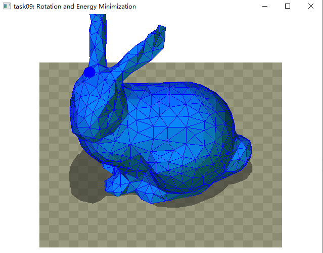
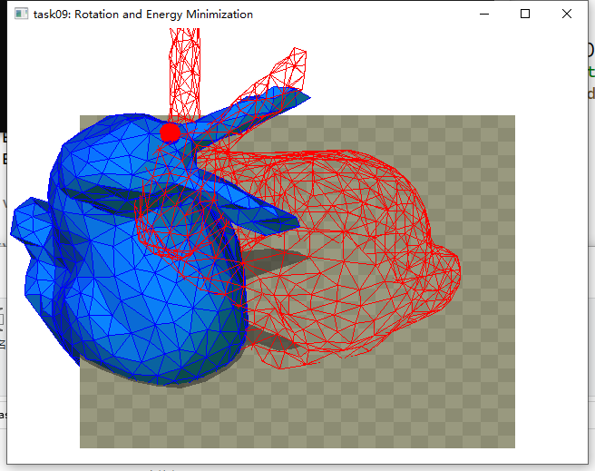

# Task09: Rotation and Energy Minimization

**Deadline: June 29st (Thu) at 15:00pm**

----

## Before Doing Assignment

If you have not done the [task00](../task00), do it first to set up the C++ graphics development environment.

Follow [this document](../doc/submit.md) to submit the assignment, In a nutshell, before doing the assignment,

- install `eigen` library following  [this document](../doc/setup_eigen.md)
- make sure you synchronized the `main ` branch of your local repository  to that of remote repository.
- make sure you created branch `task09` from `main` branch.
- make sure you are currently in the `task09` branch (use `git branch -a` command).

Now you are ready to go!

---

## Problem 1

Run the code. Take a screenshot image. 
Save the screenshot image overwriting `task09/problem1.png`

## Problem 2

This code means to hang bunny's mesh by fixing the position of one vertex under gravity.

The hanged bunny can be simulated by energy minimization w.r.t. the rigid translation and rotation. 
The energy is the sum of the gravitational potential energy and the penalty energy to fix one vertex.    
 
We minimize the energy using gradient descent method. 
Write a few lines of code around `line #74` to compute gradient of energy w.r.t translation and rotation. 
Write one line of code for translation and rotation respectively.

Save the screenshot image overwriting `task09/problem2.png`

Run the program for a while to let the minimization converge. Write down the converged energy shown in standard output below. 

***energy: == -5477.63***

## After Doing the Assignment

After modifying the code, push the code and submit a pull request.

## Notes

- Do not submit multiple pull requests. Only the first pull request is graded
- Do not close the pull request by yourself. The instructor will close the pull request
- If you mistakenly merge the pull request, it's OK, but be careful not to merge next time. 
